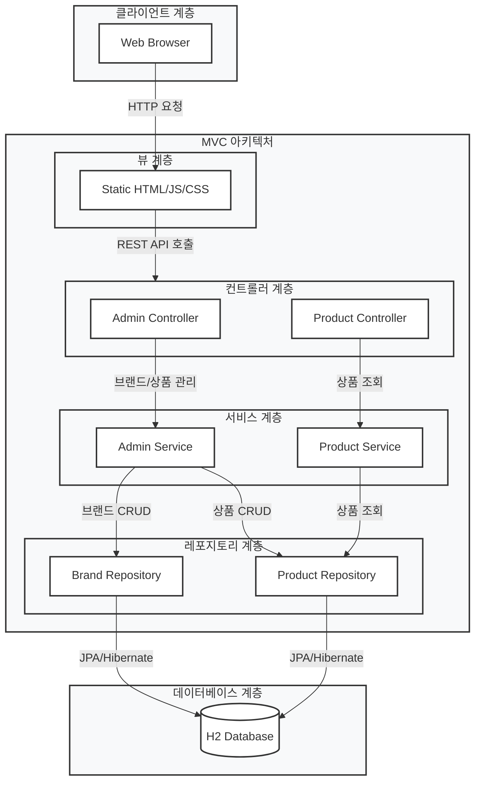
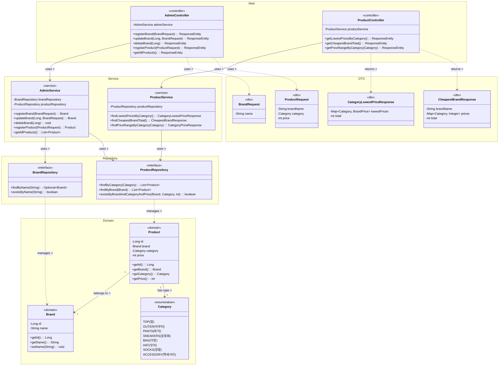
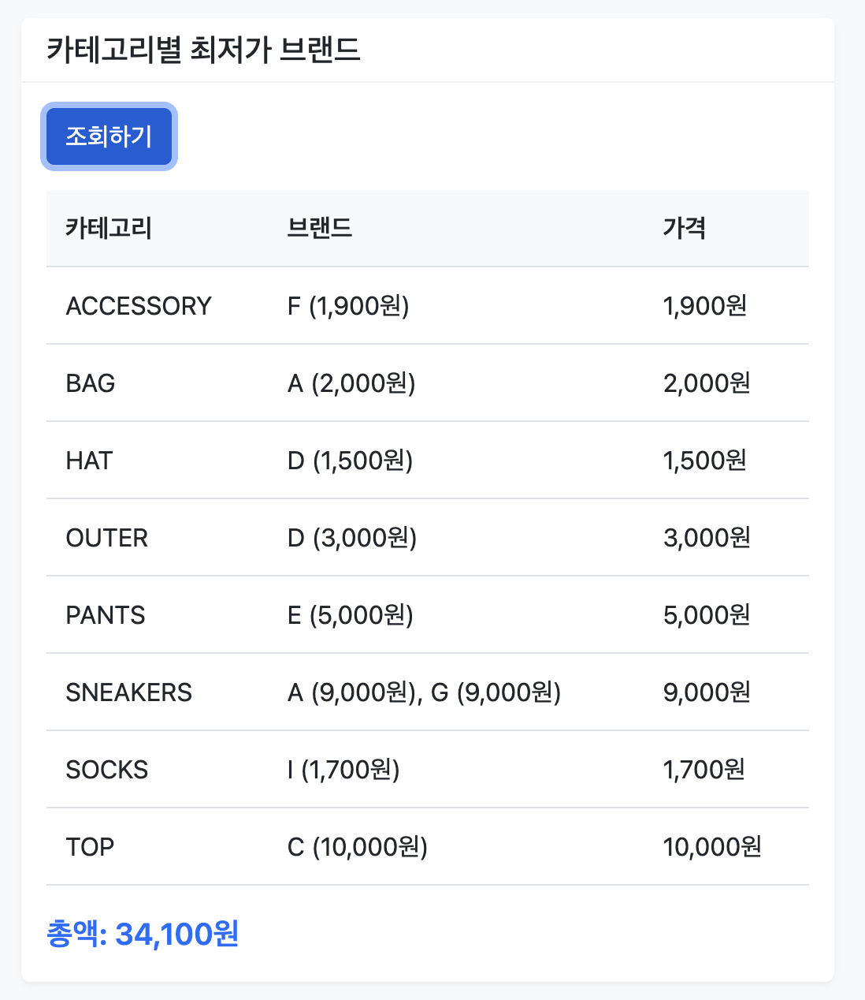
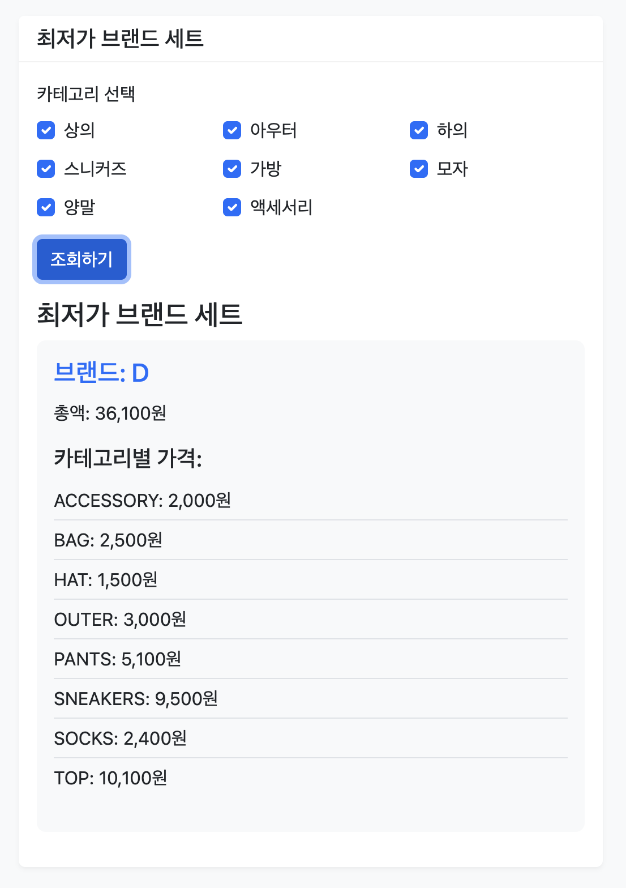
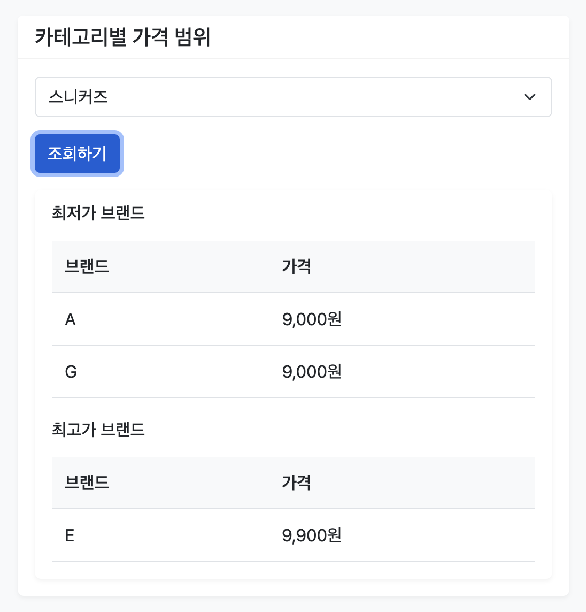
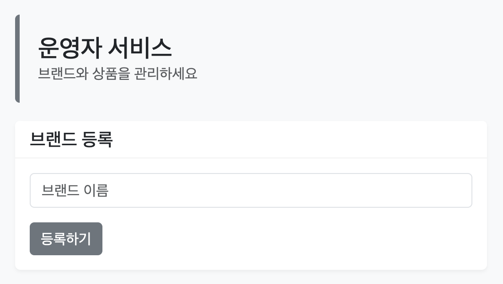
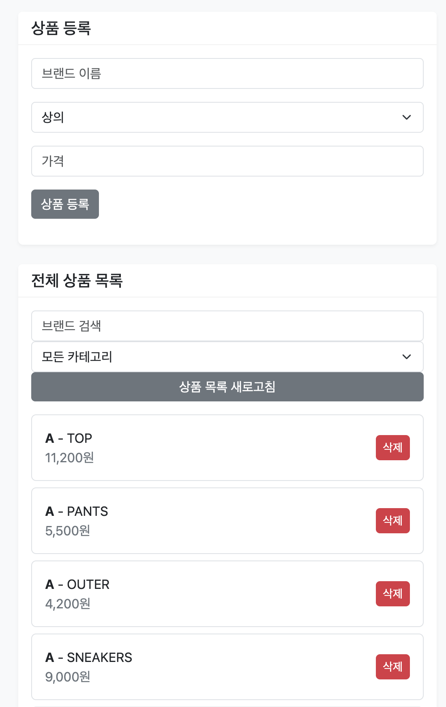

# 브랜드 코디네이터 API

브랜드별 상품 가격을 비교하고 최저가를 찾을 수 있는 API 서비스입니다.

## 시스템 아키텍처



## 클래스 다이어그램



## 기능

### 웹 인터페이스

프로젝트는 사용자 친화적인 웹 인터페이스를 제공합니다. 브라우저에서 `http://localhost:8080`에 접속하여 다음 기능들을 사용할 수 있습니다:

#### 고객 서비스
1. **카테고리별 최저가 브랜드 조회**
   - 각 카테고리별로 최저가 브랜드와 가격을 확인
   - 모든 카테고리 최저가의 총액 확인
   

2. **최저가 브랜드 세트 조회**
   - 모든 카테고리 상품을 한 브랜드에서 구매할 때 가장 저렴한 브랜드 확인
   - 카테고리별 가격과 총액 확인
   

3. **카테고리별 가격 범위 조회**
   - 특정 카테고리의 최저가/최고가 브랜드와 가격 확인
   - 동일 가격대의 여러 브랜드 동시 표시
   

#### 운영자 관리
1. **브랜드 관리**
   - 새로운 브랜드 등록
   

2. **상품 관리**
   - 브랜드별 상품 등록
   - 상품 목록 조회
   - 상품 삭제
   

### REST API

다음 API 엔드포인트들을 통해 서비스를 이용할 수 있습니다:

#### 고객용 API
- `GET /api/products/lowest-prices`: 카테고리별 최저가 브랜드 조회
- `GET /api/brands/cheapest`: 최저가 브랜드 세트 조회
- `GET /api/categories/{category}/price-range`: 카테고리별 가격 범위 조회

#### 운영자용 API
- `POST /api/admin/brands`: 브랜드 등록
- `POST /api/admin/products`: 상품 등록
- `GET /api/admin/products`: 상품 목록 조회
- `DELETE /api/admin/products/{id}`: 상품 삭제

### 예외 처리

서비스는 다음과 같은 상황에서 예외를 발생시킵니다:

#### 브랜드 관련 예외
- 브랜드 등록 시 이미 존재하는 브랜드 이름인 경우
  ```
  이미 등록된 브랜드입니다: [브랜드명]
  ```
- 브랜드 수정 시 존재하지 않는 브랜드 ID인 경우
  ```
  존재하지 않는 브랜드입니다: [브랜드ID]
  ```
- 브랜드 수정 시 변경하려는 이름이 이미 존재하는 경우
  ```
  이미 등록된 브랜드입니다: [브랜드명]
  ```

#### 상품 관련 예외
- 상품 등록 시 존재하지 않는 브랜드인 경우
  ```
  Brand not found with name: [브랜드명]
  ```
- 상품 등록 시 이미 동일한 브랜드, 카테고리, 가격의 상품이 존재하는 경우
  ```
  이미 등록된 상품입니다: 브랜드=[브랜드명], 카테고리=[카테고리], 가격=[가격]
  ```
- 상품 삭제 시 존재하지 않는 상품 ID인 경우
  ```
  Product not found with id: [상품ID]
  ```

#### 조회 관련 예외
- 카테고리별 가격 범위 조회 시 해당 카테고리의 상품이 없는 경우
  ```
  해당 카테고리의 상품이 없습니다: [카테고리]
  ```
- 최저가 브랜드 세트 조회 시 카테고리를 선택하지 않은 경우
  ```
  카테고리를 선택해주세요
  ```
- 최저가 브랜드 세트 조회 시 선택한 카테고리의 상품이 없는 경우
  ```
  선택한 카테고리의 상품이 없습니다
  ```

## 기술 스택

- Backend: Spring Boot
- Frontend: HTML, CSS, JavaScript
- UI Framework: Bootstrap 5
- Database: H2 (개발용 인메모리 DB)

## 시작하기

1. 프로젝트 클론
   ```bash
   git clone https://github.com/yeokyeong-yoon/brand-coordinate-api.git
   ```

2. 프로젝트 디렉토리로 이동
   ```bash
   cd brand-coordinate-api
   ```

3. 애플리케이션 실행
   ```bash
   ./gradlew bootRun
   ```

4. 웹 브라우저에서 접속
   ```
   http://localhost:8080
   ```

## 테스트

테스트 실행:
```bash
./gradlew test
```

## API 문서

API 문서는 Swagger UI를 통해 확인할 수 있습니다:
```
http://localhost:8080/swagger-ui.html
``` 